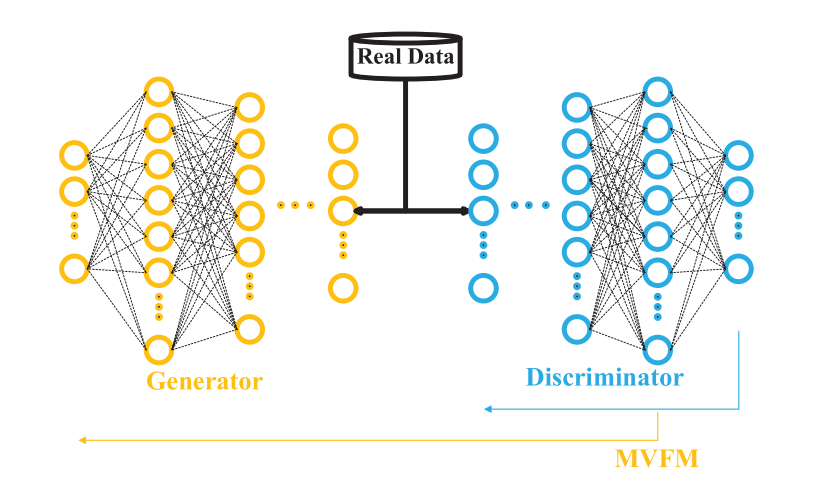

# Generative Model Research of PRCI-Lab
### COMIM-GAN: Improved Text-to-Image Generation via Condition Optimization and Mutual Information Maximization   
*Longlong Zhou, Xiao-Jun Wu, and Tianyang Xu,* **MMM**, 2023. (**oral**)  

#### [[Paper](https://arxiv.org/abs/2208.09787)] 
---

### Generating adversarial examples with elastic-net regularized boundary equilibrium generative adversarial network
*Cong Hu, Xiao-Jun Wu, Zuo-Yong Li*, **PRL**, 2020.  

#### [[Paper](https://ieeexplore.ieee.org/abstract/document/10015806)]  
---

### Dual Encoder-Decoder Based Generative Adversarial Networks for Disentangled Facial Representation Learning
*CONG HU, ZHENHUA FENG, XIAOJUN WU, AND JOSEF KITTLER*, **IEEE Access**, 2020.  

#### [[Paper](https://ieeexplore.ieee.org/abstract/document/10015806)] 
---

### Bagging deep convolutional autoencoders trained with a mixture of real data and GAN-generated data
*Cong Hu1, Xiao-Jun Wu, Zhen-Qiu Shu*, **KSII TIIS**, 2019.  

#### [[Paper](https://ieeexplore.ieee.org/abstract/document/10015806)] 
---

### Semi-Supervised Learning Based on GAN With Mean and Variance Feature Matching
*Cong Hu, Xiao-Jun Wu , and Josef Kittler*, **IEEE TCDS**, 2018.  

#### [[Paper](https://ieeexplore.ieee.org/abstract/document/10015806)]  

